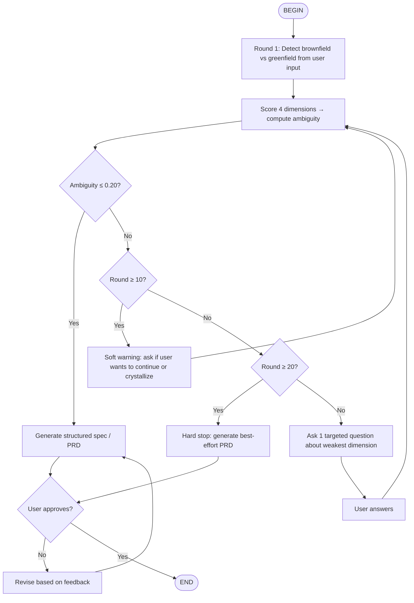

# Deep Interview

Before building, clarify. Use Socratic questioning to surface hidden assumptions, constraints, and success criteria. Score ambiguity dimension by dimension. Stop only when the work is well-defined enough to act on.

## When to Use

- User asks for a feature with < 3 concrete details
- Scope feels ambiguous or open-ended
- Multiple interpretations are possible
- Success criteria are unstated

## Interview Rules

1. **One question per round.** No multi-part questions. No laundry lists.
2. **Always target the weakest dimension.** Score after each answer; ask about the lowest-scored area next.
3. **Cite what the user already said.** Reference prior answers or ticket content when framing your question.
4. **No spec until ambiguity ≤ 20%.** Do not produce the final PRD until the threshold is met.
5. **Soft warning at round 10.** If ambiguity is still > 20%, acknowledge progress and ask the user if they want to continue or crystallize what you have.
6. **Hard stop at round 20.** Generate the best PRD possible with whatever clarity exists. Do not exceed 20 rounds.

## Workflow

1. **Read** `docs/specs/_template.md` to know what information is needed.
2. **Interview** the user using the flow below to fill Goal, Constraints, Non-Goals, Success Criteria.
3. **Stop** when you can state the exact files, functions, and changes required.
4. **Write** the spec to `docs/specs/<kebab-case-title>.md`.

## Flow



## Context Detection (Round 1 only)

| Type | Signal | Implication |
|------|--------|-------------|
| **Brownfield** | Modifying existing system, codebase, or integration | Ask about current stack, dependencies, backward compatibility, migration path |
| **Greenfield** | New feature or system from scratch | Focus on scope boundaries, user flows, and MVP vs future |

## Ambiguity Scoring

After every user answer, score each dimension 0.0–1.0 (1.0 = fully clear).

### Brownfield weights
```
ambiguity = 1 - (goal×0.35 + constraints×0.25 + success_criteria×0.25 + context×0.15)
```

### Greenfield weights
```
ambiguity = 1 - (goal×0.40 + constraints×0.30 + success_criteria×0.30)
```

### Dimensions

| Dimension | What "clear" means |
|-----------|-------------------|
| **Goal** | One-sentence purpose. Who benefits and why. No hedging. |
| **Constraints** | Time, budget, tech stack, compatibility, compliance, performance. Known hard limits. |
| **Success criteria** | Measurable outcomes. "Done" is falsifiable. Tests or demos prove it. |
| **Context** | Brownfield only: existing architecture, APIs, data models, deployment targets, team norms. |

### Internal scoring rubric (do not expose to user)

- **0.0–0.3**: Vague, contradictory, or missing entirely
- **0.4–0.6**: Partially clear; needs examples, boundaries, or verification
- **0.7–0.9**: Clear enough to act; minor details remain
- **1.0**: Fully specified with no open questions

## Questioning Strategy

1. Identify the dimension with the lowest score.
2. Formulate exactly one question that, if answered well, would raise that score the most.
3. Prefer concrete examples over abstractions ("What does a user do on step 3?" beats "What is the user experience?").
4. When two dimensions tie, prioritize: **Goal > Success criteria > Constraints > Context**.

## Example Questions by Dimension

| Dimension | Example |
|-----------|---------|
| Goal | "You said 'improve checkout' — whose checkout, and what does 'improve' mean in one metric?" |
| Constraints | "You need this by Friday — what is the minimum version that still delivers value if Friday slips?" |
| Success criteria | "How would you verify this works in production? What log, event, or test would convince you?" |
| Context | "This integrates with the existing auth service — which endpoints does it touch, and are any deprecated?" |

## Stop Signal

If you find yourself generating a numbered list of possible interpretations, you are guessing → delete the list and ask one question.

## Output Format

When ambiguity ≤ 0.20 (or at hard stop), produce:

```markdown
## Spec

### Goal
One sentence. No conjunctions.

### Type
Brownfield | Greenfield

### Scope
- **In scope:** ...
- **Out of scope:** ...

### Constraints
- Time: ...
- Budget: ...
- Tech: ...
- Other: ...

### Success Criteria (measurable)
- [ ] ...
- [ ] ...

### Context (brownfield only)
- Existing system: ...
- APIs / dependencies: ...
- Migration / rollback: ...

### User Stories
| ID | Title | Priority | Acceptance Criteria |
|----|-------|----------|---------------------|
| US-001 | ... | high | ... |

### Hardening
- [ ] Security review
- [ ] Error handling
- [ ] Observability
- [ ] Rollback plan

### Clarity Scores
| Dimension | Score |
|-----------|-------|
| Goal | 0.0 |
| Constraints | 0.0 |
| Success criteria | 0.0 |
| Context | 0.0 |
| **Final ambiguity** | **0.0** |
```

Write the completed spec to `docs/specs/<kebab-case-title>.md`.

## State Management

This skill is stateless. The caller (you) is responsible for:

- Tracking the current round number.
- Retaining prior questions and answers in context.
- Recalculating ambiguity scores before each new question.
- Detecting when the user updates requirements mid-interview (treat as Round 1 restart).

When restarting due to changed requirements:
1. Acknowledge the change explicitly.
2. Discard prior scores.
3. Re-run context detection and Round 1 scoring from scratch.
